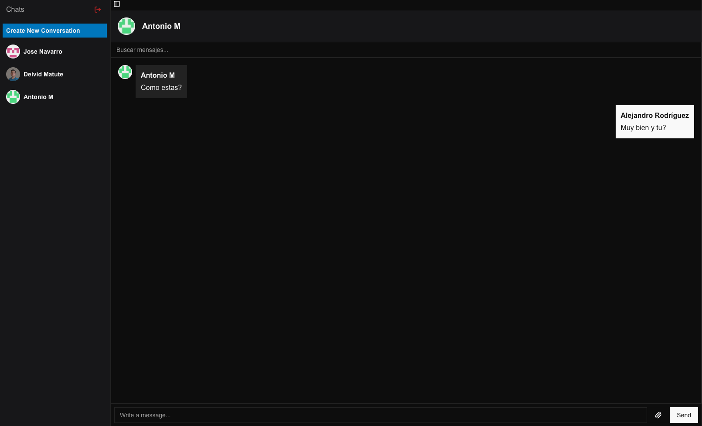
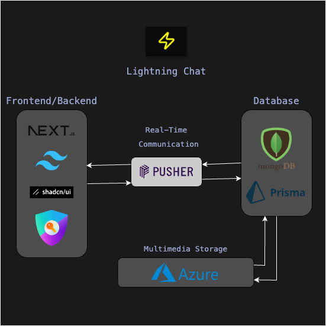

<div align="center">
<a href="#">

</a>
<p></p>
</div>

## 🛠️ Stack

- [**NextJS**](https://nextjs.org/) - Framework
- [**TailwindCSS**](https://tailwindcss.com/) - Styling
- [**Shadcn/UI**](https://ui.shadcn.com/) - Components
- [**Pusher**](https://pusher.com/) - Realtime
- [**OpenAI**](https://openai.com/) - AI Bot
- [**Prisma**](https://prisma.io/) - ORM
- [**Azure Blob Storage**](https://azure.microsoft.com/en-us/products/storage/blobs/) - Media Storage


## Diagram of the Architecture

<div align="center">
<a href="#">

</a>
</div>

The architecture integrates several key components, each with a specific role in delivering the chat service. Below is a step-by-step explanation of how everything connects:

1. **Frontend/Backend**: Built with Next.js and enhanced with ShadCN/UI for a modern interface, this serves as the main entry point for users. The application handles both client-side interactions and server-side operations through Next.js's unified architecture.
2. **Real-Time Communication**: At the core of the system, Pusher manages real-time message delivery. It maintains open connections between clients and servers, enabling instant message updates and notifications without requiring page refreshes.
3. **Database Layer**: The application uses MongoDB as the primary database, with Prisma serving as the ORM (Object-Relational Mapper). This combination handles data persistence for messages, user profiles, and chat history, ensuring efficient data management and retrieval.
4. **Multimedia Storage**: Azure cloud services manage all multimedia content (images, files, voice messages). This provides a scalable and reliable solution for storing and serving media files shared within chats.
5. **Security**: The architecture incorporates security features through Next.js's built-in protections and additional authentication layers, ensuring secure message transmission and user data protection.

## 🚀 Getting Started

You will need:

- [NodeJS](https://nodejs.org/en/)
- [MongoDB](https://www.mongodb.com/)
- [Pusher](https://pusher.com/)
- [OpenAI](https://openai.com/)
- [Azure Blob Storage](https://azure.microsoft.com/en-us/products/storage/blobs/)

1. Clone the repository

```bash
git clone https://github.com/your-repo/chat-app.git
```

2. Install dependencies

```bash
npm install
```

3. Add your credentials to the `.env` file

```env
DATABASE_URL="your_mongodb_connection_string"
AUTH_SECRET="your_auth_secret"
AUTH_GITHUB_ID="your_github_id"
AUTH_GITHUB_SECRET="your_github_secret"
AUTH_URL=http://localhost:3000

NEXT_PUBLIC_PUSHER_APP_KEY="your_pusher_app_key"
PUSHER_APP_ID="your_pusher_app_id"
PUSHER_SECRET="your_pusher_secret"
AZURE_STORAGE_CONNECTION_STRING="your_azure_storage_connection_string"
ENCRYPTION_KEY="your_encryption_key"
NEXT_PUBLIC_ENCRYPTION_KEY="your_public_encryption_key"
OPENAI_API_KEY="your_openai_api_key"
```

4. Run the development server

```bash
npm run dev
```

## ✌️ Contributing

<a href="https://github.com/alerodriguezn/chat-app/graphs/contributors">
  
</a>
